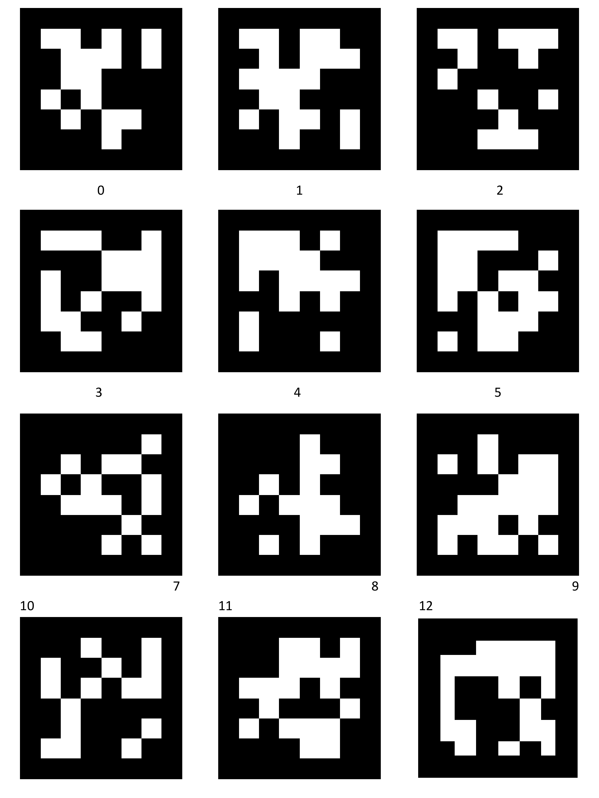

# FYP-Drone

## Hardware information
### Computer
* `Illegear onyx v ryzen` : [Illegear Website](https://www.illegear.com/staging/ms/onyx-series/30-onyx-v-ryzen.html#/peripherals-63wh_battery_pack_upgrade/laptop_display-15_6_120hz_full_hd_anti_glare_ips_infinivision_display/1st_m_2_solid_state_drive-500gb_m_2_pcie_nvme_solid_state_drive/operating_system-windows_10_free_trial_edition_no_license_key/laptop_warranty-2_year_carry_in_warranty_lifetime_technical_support/laptop_processor-amd_ryzen_5_4600h_processor_6_cores_12_threads_3_0ghz_to_4_0ghz/laptop_graphics_card-nvidia_geforce_gtx_1650_4gb_gddr6_with_optimus/thermal_cooling-stock_standard_thermal_compound/laptop_ram-8gb_ddr4_ram_3200mhz_1_x_8gb/2nd_m_2_solid_state_drive-none/wireless_network_card-intel_wi_fi_6_ax200_2x2_m_2_wlan_bluetooth_5_1_combo)

* AMD Ryzen 7 4000 series
* NVidia Geforce 1650
* 16GB Ram
* Ubuntu 20.04 : [Ubuntu Download](https://ubuntu.com/download/desktop)
* ROS Noetic : [Noetic for Ubuntu Download](http://wiki.ros.org/noetic/Installation/Ubuntu)

### Raspberry Pi 4

* 8GB Ram Version
* Ubuntu Mate 20.04 64-bit : [Ubuntu Mate Download](https://ubuntu-mate.org/download/)
* ROS Noetic : [Noetic for Ubuntu Download](http://wiki.ros.org/noetic/Installation/Ubuntu)


## Camera Calibration


## Apriltag
`Apriltag_ros Package` can be downloaded from the [AprilTag Official Website](https://github.com/AprilRobotics/apriltag_ros)

### Setup
`This is required` if you download directly from the [AprilTag Official Website](https://github.com/AprilRobotics/apriltag_ros) but if you downloaded from this repository you can skip to no.5

1.Placing the tag id in the [tags.yaml](https://github.com/Isaac9804/FYP-Drone/blob/aa2f3e5a3a2799efdec1f08c26a21d8d6e49e7c4/apriltagros_catkin/src/apriltag_ros/apriltag_ros/config/tags.yaml)
 file located:
```bash
cd ~/FYP-Drone/apriltagros_catkin/src/apriltag_ros/apriltag_ros/config
nano tags.yaml
```
```yaml

# Adding code below to the tags.yaml file
# Line 20

standalone_tags:
  [
     {id: 0 , size: 0.157},
     {id: 1 , size: 0.157},
     {id: 2 , size: 0.157},
     {id: 3 , size: 0.157},
     {id: 4 , size: 0.157},
     {id: 5 , size: 0.157},
     {id: 6 , size: 0.157},
     {id: 7 , size: 0.157},
     {id: 8 , size: 0.157},
     {id: 9 , size: 0.157},
     {id: 10 , size: 0.157},
     {id: 11 , size: 0.157},
     {id: 12 , size: 0.157},
     {id: 13 , size: 0.157},
     {id: 14 , size: 0.157},
     {id: 15 , size: 0.157},
     {id: 16 , size: 0.157},

  ]
  ```
2. Adding [cv_ros.py]() and [camera_info.py]() into the src file

```bash
cd ~/FYP-Drone/apriltagros_catkin/src/apriltag_ros/apriltag_ros/src
nano cv_ros.py       # Paste the code from cv_ros.py into here
nano camera_info.py  # Paste the code from camera_info.py into here
```
3.Configuring the [continuous_detection.launch](https://github.com/Isaac9804/FYP-Drone/blob/aa2f3e5a3a2799efdec1f08c26a21d8d6e49e7c4/apriltagros_catkin/src/apriltag_ros/apriltag_ros/launch/continuous_detection.launch) file will allow to us to execute the `cv_ros.py` and `camera_info.py` simultaneously.

```bash
cd ~/FYP-Drone/apriltagros_catkin/src/apriltag_ros/apriltag_ros/launch
nano continous_detection.launch        # Paste the code below into the continuous_detection.launch file
```
```xml
<!-- Add this to line 19 of the continuous_detection.launch file -->

<node name="camera" pkg="apriltag_ros" type="cv_ros.py" />
<node name="info" pkg="apriltag_ros" type="camera_info.py" />
```

4.Adding [usb_cam.launch](https://github.com/Isaac9804/FYP-Drone/blob/aa2f3e5a3a2799efdec1f08c26a21d8d6e49e7c4/apriltagros_catkin/src/apriltag_ros/apriltag_ros/launch/usb_cam.launch) file
```bash
cd ~/FYP-Drone/apriltagros_catkin/src/apriltag_ros/apriltag_ros/launch
nano usb_cam.launch        # Paste the code from usb_cam.launch into here
```

5.Building and launching the package

```bash
# Building the package
cd ~/FYP-Drone/apriltagros_catkin
source /opt/ros/noetic/setup.bash
catkin_make_isolated

#Launching the package
source ~/FYP-Drone/apriltagros_catkin/devel_isolated/setup.bash
roslaunch apriltag_ros continuous_detection.launch
```
6.To view the image_detection : [Tag for testing](https://github.com/Isaac9804/FYP-Drone/blob/ba25caf635169bb35377c764af463dce2361df72/Images/ros-apriltag-board.png)
```bash
rqt_image_view    # Place a printed out tag and the id will be displayed.
```
Preview Image of testing:



